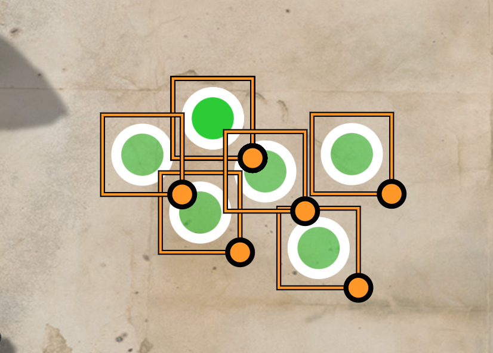
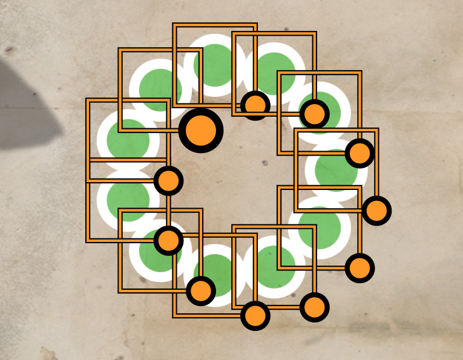
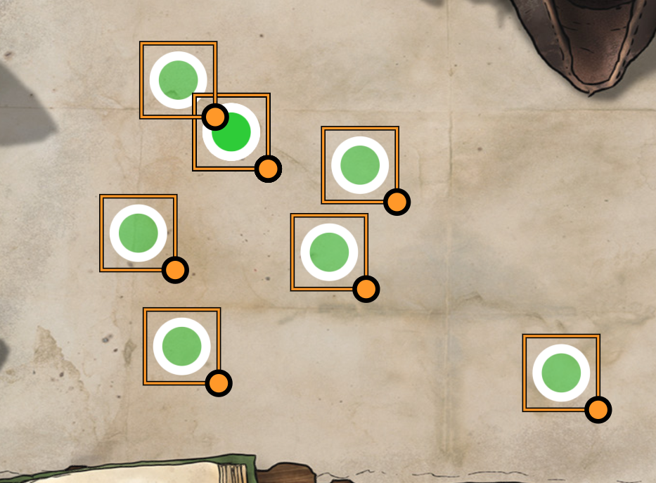
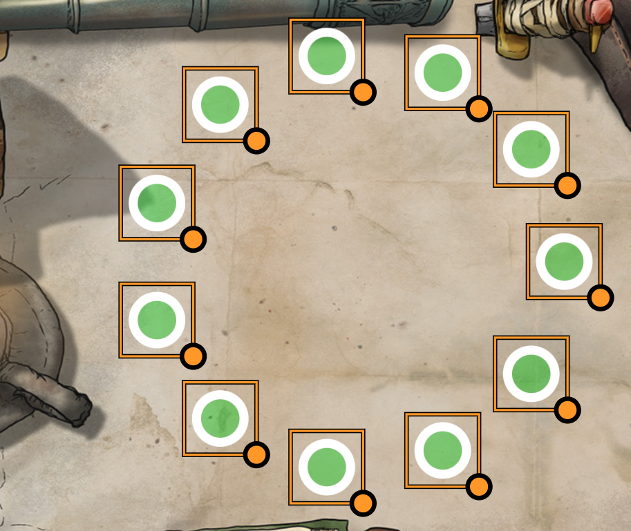

# Drawing and Tile Alignment Tool

A Foundry VTT module that will allow you to align tiles and drawing objects.  There isn't any future plans for this plugin unless someone suggests a feature that I feel would be benefitial.

When creating a circle or grid, the width/diameter is determined by the distance between the two objects which are the furthest apart.  So, to make a bigger circle drag one of the objects further away.  

For example you can left align text to present it in a nicer layout.

Here is an example of horizontally aligning to the center with a vertical distribution.

<table>
  <tr><th>Before</th><th>After</th></tr>
  <tr>
    <td>
        
    </td>
    <td>
      
    </td>
  </tr>
</table>

Here is a small circle.

<table>
  <tr><th>Before</th><th>After</th></tr>
  <tr>
    <td>
        
    </td>
    <td>
      
    </td>
  </tr>
</table>
Here is a bigger circle.

<table>
  <tr><th>Before</th><th>After</th></tr>
  <tr>
    <td>
        
    </td>
    <td>
      
    </td>
  </tr>
</table>
