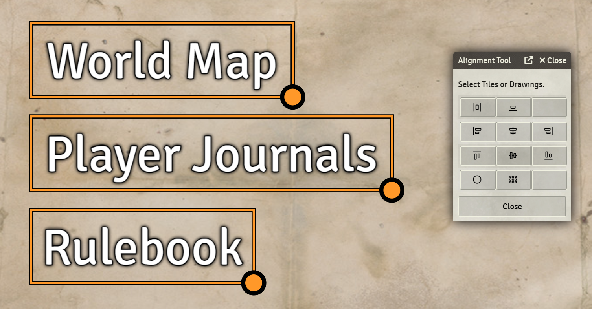
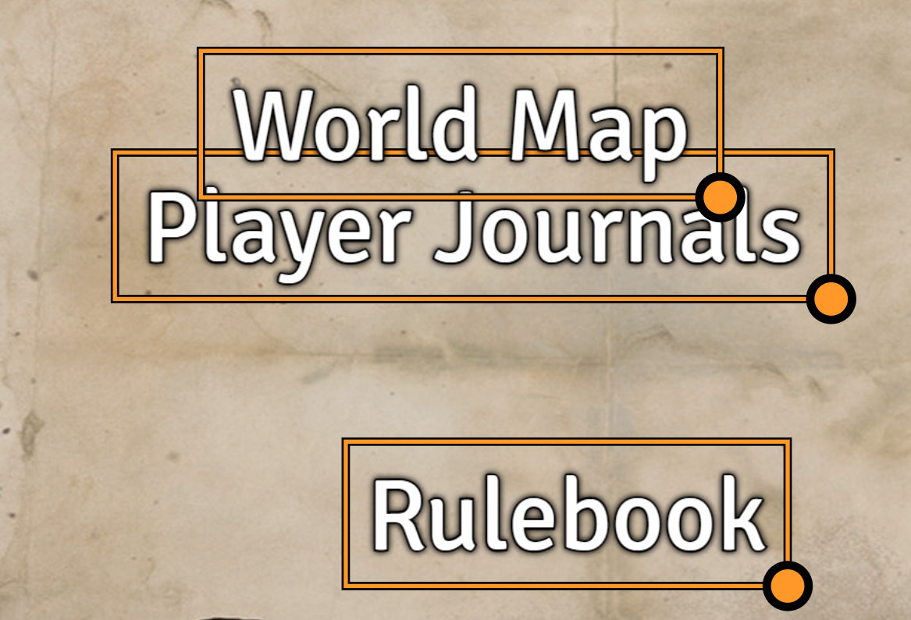
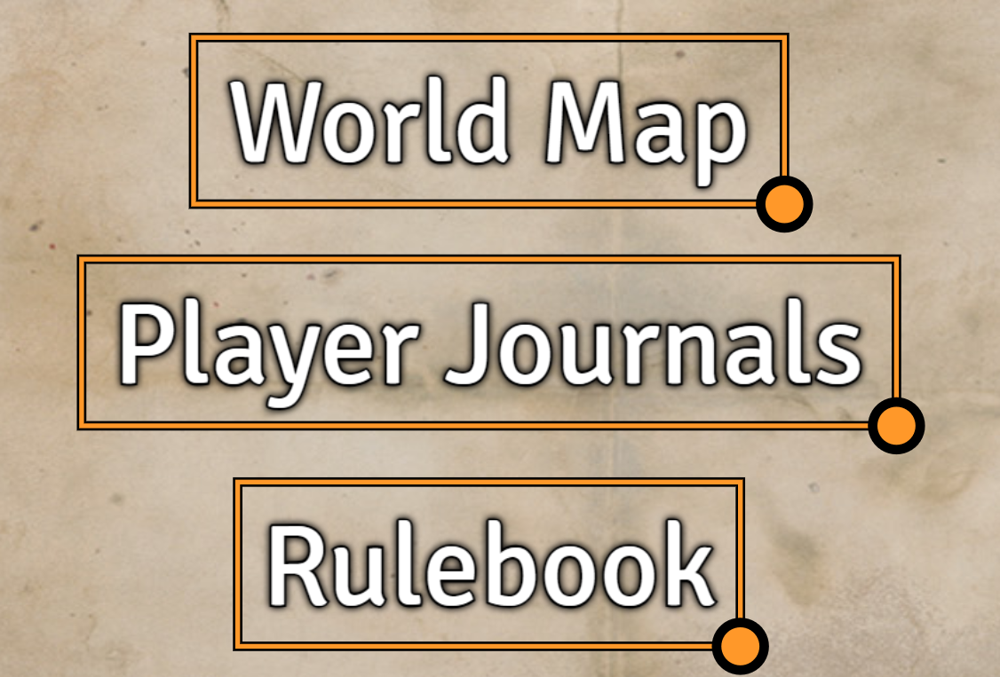

# Drawing and Tile Alignment Tool

A Foundry VTT module that will allow you to align tiles and drawing objects.  There isn't any future plans for this plugin unless someone suggests a feature that I feel would be benefitial.

When creating a circle or grid, the width/diameter is determined by the distance between the two objects which are the furthest apart.

For example you can left align text to present it in a nicer layout.

Here is an example of horizontally aligning to the center with a vertical distribution.

Before:

After:

